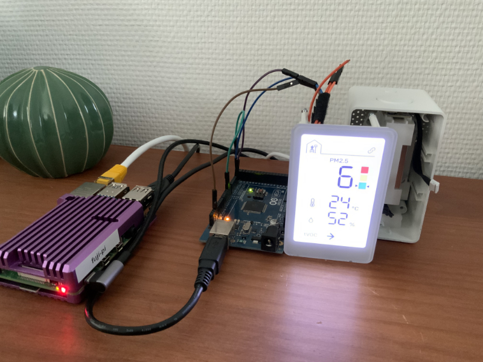

# IKEA VINDSTYRKA Sensor shenanigans
Ramblings about IKEA VINDSTYRKA and its sensor implementation.

## Sensor

VINDSTYRKA contains a [Sensirion SEN54](https://sensirion.com/products/catalog/SEN54/) environmental sensor node, which can easily be interfaced with via I2C. The interesting bit is how IKEA implemented this sensor.

Implementations for ESPHome and Arduino are widely available, however these libraries yield different (and inaccurate) readings for temperature and humidity compared to what is displayed on VINDSTYRKA.

This discrepancy can be explained by the way IKEA processes the data, instead of using the preprocessed data from the sensor IKEA opted to use the raw sensor output (including undocumented mystery data!) to compute the values for temperature, humidity and tVOC trend.

The goal of this exercise is to come up with a correction curve that can be used to accurately post-process the SEN54 data.

## Sniffing

VINDSTYRKA (`V`) sends the following commands to the SEN54 (`S`):

Once at startup:
```
V -> S: 0x00 0x21         Start measurements
```

Repeated roughly every second:
```
Dir.    Data              Description                       Note
V -> S: 0x02 0x01         CMD: Read data ready flag
V <- S: 0x00 0x01 CRC     Data ready flag response          [0]

V -> S: 0x03 0xC4         CMD: Read measured values
V <- S: MSB  LSB  CRC     PM1.0 reading * 10 (uint16)
        MSB  LSB  CRC     PM2.5 reading * 10 (uint16)       [1]
        MSB  LSB  CRC     PM4.0 reading * 10 (uint16)
        MSB  LSB  CRC     PM10.0 reading * 10 (uint16)
        MSB  LSB  CRC     Processed humidity * 100 (uint16)
        MSB  LSB  CRC     Processed temperature * 200 (uint16)
        MSB  LSB  CRC     Processed VOC Index * 10 (uint16)
        MSB  LSB  CRC     Processed NOX Index * 10 (uint16)

V -> S: 0x03 0xD2         CMD: Read raw measurements
V <- S: MSB  LSB  CRC     Raw humidity * 100 (uint16)
        MSB  LSB  CRC     Raw temperature * 200 (uint16)
        MSB  LSB  CRC     Raw VOC (uint16)                  [2]
        MSB  LSB  CRC     Raw NOX (uint16)

V -> S: 0x03 0xF5         CMD: Read raw mystery measurement
V <- S: MSB  LSB  CRC     Raw humidity * 100 (uint16)       [3]
        MSB  LSB  CRC     Raw temperature * 200 (uint16)    [4]
        ???  ???  CRC     Mystery word                      [5]
```

### Footnotes:
0. VINDSTYRKA respects the data ready flag and validates the CRC's.
1. VINDSTYRKA only appears to be using the PM2.5 reading from the processed values.
2. Raw VOC influences the tVOC trend arrow and VOC Index value available through Zigbee cluster `0xFC7E`.
3. Value used to compute humidity.
4. Value used to compute temperature.
5. Undocumented bytes; influences humidity and temperature readings in a significant way.

## Emulating the sensor


To aide in this research I wrote an [Arduino implementation](sen54mock/sen54mock.ino) of the SEN54 that allows VINDSTYRKA to be fed arbitrary values over I2C.

### Humidity and Temperature behavior

On startup VINDSTYRKA takes the humidity and temperature readings straight from the raw values returned by mystery command `0x03F5`, then a correction algorithm kicks in and the values start to drift away...

Continuously feeding 40 % humidity (40 * 100 = 4000), 25 degrees C (25 * 200 = 5000), and a mystery word of `0xFB0C` results in the device starting up with 40 % and 25 C on the display; then the values drift for ~15 minutes before finally settling on 68 % and 16 C 🤔.

Altering the mystery word slightly to `0xFB0B` results in the values going all over the place before slowly settling near the previous readouts.

The temperature value also influences the humidity readout (and vice versa).

This likely requires disassembly of the firmware to properly understand.

### tVOC behavior

Simulating a raw VOC of 30000 starts the device off with the arrow pointing flat and a reported VOC Index of 100. Increasing the raw value to 31000 makes the arrow point DOWN and the reported VOC Index decrease.

After a while the VOC Index returns to 100 (the new baseline) and the arrow points flat again. Decreasing the value back to 30000 makes the arrow point UP and the VOC Index shoot up.

Within a few minutes VINDSTYRKA learns the new baseline and returns to reporting a VOC Index of 100.

## Data logging



To correlate the SEN54 output with the processed output of VINDSTYRKA I wrote an [Arduino sketch](sen54logger/sen54logger.ino) that echos the SEN54 data over serial.

An anti-collision mechanism was implemented to allow both VINDSTYRKA and the logger to co-exist on the I2C bus without interfering with each other. The logger also ensures that it does not prematurely clear the "data ready" flag on the sensor, as that could influence the readings received by VINDSTYRKA.

Collision detection requires the SCL line to be duplicated to a second input pin on the Arduino, this allows the logger to time its transmissions within the idle time of VINDSTYRKA.

A CSV-formatted line containing the measured values, raw values, and mystery values is printed out to the serial port with each successful acquisition.

### Logging VINDSTYRKA values

Processed readings from VINDSTYRKA can be acquired by interrogating the Zigbee clusters.

VINDSTYRKA exposes its values in the following Zigbee clusters:
```
0x0405 # Humidity
0x0402 # Temperature
0x042a # PM2.5
0xfc7e # VOC index
```

The values reported over Zigbee are identical to what is displayed on VINDSTYRKA (except for the VOC Index, which is displayed as a trend arrow). All values are reported in whole numbers with no decimal places.

To bring it all together I created a [Python script](vindstyrka_logger/log_values.py) that monitors the serial port for readings from the Arduino logger, after receiving a reading it then fetches the VINDSTYRKA values from Home Assistant through the ZHA Websocket API. Finally all these data points are written to a CSV file.

*Research continues once enough data points have been acquired.*
